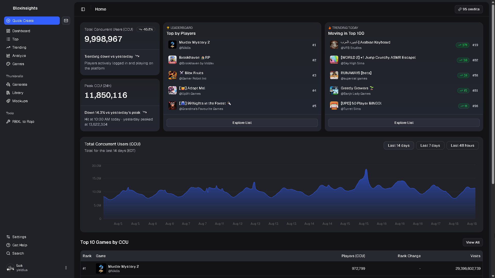

<p align="center">
  
  <h1 align="center">Bloxinsights</h1>
</p>

<p align="center">
  A dashboard for tracking Roblox game analytics like CCU, letting you see what's trending. It also has tools for thumbnail generation and file conversion.
</p>

<p align="center">
   <a title="Build Status" target="_blank" href="https://github.com/ahmoin/bloxinsights"></a>
  <a title="MIT License" target="_blank" href="https://github.com/ahmoin/bloxinsights/blob/main/LICENSE.md">
  <a title="GitHub Commits" target="_blank" href="https://github.com/ahmoin/bloxinsights/commits/main"></a>
  <a title="Last Commit" target="_blank" href="https://github.com/ahmoin/bloxinsights/commits/main"></a>
</p>

---

## About

Bloxinsights tracks CCU across top Roblox games and puts into a dashboard with leaderboards and lets you filter and sort them. It also has an AI chatbot and an AI thumbnail generator.

_[live website](https://bloxinsights.vercel.app/)_

## Features

* **Dashboard** with 8 cards (CCU Chart, Top Moving Games, New Releases, Top by Favorites, Top by Visits, Top by Players, Top by Up Votes, and Recent Movers)
* **Top Roblox Games** with genre selection and filter selection.
* **Lists** lists you all the games in the database letting you select out of 7 metrics, sorts, filters, and shows rank on the left.
* **Analyze** lets you ask ask an AI chatbot about platform stats.
* **Thumbnails** to generate thumbnails using AI which you can view in the libray or as mockups. You can also upload existing thumbnails to your library to viwe them in mockups.

## Getting Started

Please visit the _[live website](https://bloxinsights.vercel.app/)_ to get started.

### Running locally

1. Clone the repo and install packages with pnpm.
You can get pnpm here: https://pnpm.io/installation

Run:
```bash
git clone https://github.com/ahmoin/bloxinsights.git
cd bloxinsights
pnpm install 
```

2. Make the environment variables file by copying `.env.example` to `.env.local` and filling in the values.
```bash
cp .env.example .env.local
```

* `BETTER_AUTH_SECRET`: generate one with `openssl rand -base64 32` or click Generate Secret on the [BetterAuth docs](https://better-auth.com/docs/installation)
* `BETTER_AUTH_URL`: the URL your app runs on. Use `http://localhost:3000` for local development and use your production URL for production.
* `ROBLOX_CLIENT_ID` & `ROBLOX_CLIENT_SECRET`: create a Roblox OAuth app at the [Roblox Creator Dashboard](https://create.roblox.com/dashboard/credentials) and set the redirect URL to `http://localhost:3000/api/auth/callback/roblox` or replace localhost:3000 with your production domain for production deployments.
* `GOOGLE_CLIENT_ID` & `GOOGLE_CLIENT_SECRET`: create an OAuth client at the [Google Cloud Console](https://console.cloud.google.com/apis/credentials) and set the redirect URL to `http://localhost:3000/api/auth/callback/google` or replace localhost:3000 with your production domain for production deployments.
* `OPENROUTER_API_KEY`: create a key at https://openrouter.ai/keys, used for the Analyze chat assistant and AI thumbnail generation.
* `TURSO_DATABASE_URL` / `TURSO_AUTH_TOKEN`: the URL and auth token for a libSQL server (we self host [`ghcr.io/tursodatabase/libsql-server`](https://github.com/tursodatabase/libsql) on Railway). The env var names ("TURSO_") are a holdover from when this ran on Turso's hosted service, point them at your own libSQL server URL and token instead.
* `BLOB_READ_WRITE_TOKEN`: create a Vercel Blob https://vercel.com/docs/storage/vercel-blob store in a Vercel project and copy the token from the `.env.local` tab, used to store generated thumbnails.
* `CRON_SECRET`: a secret used to authorize the 30m cron job https://cron-job.org. Generate one with `openssl rand -base64 32`.

3. Push the database schema to your Turso database:
```bash
pnpm db:push
```

4. Start the dev server:
```bash
pnpm dev
```

5. Open http://localhost:3000 in your browser.

## FAQ

### Is Bloxinsights free to use?

Yes. You can try the live web app at [bloxinsights.vercel.app](https://bloxinsights.vercel.app). You can also clone the repository and self host it locally using your own API keys. Check [.env.example](/.env.example) for the required environment variables.

### Where does the CCU data come from?

Bloxinsights runs on https://cron-job.org checking the Roblox API every 30m storing snapshots in a the libSQL database. Dashboard stats like average and peak CCU are from those snapshots.

### Can I self host or run Bloxinsights locally?

Yes, follow the repo setup above and set up your own environment variables, then run `pnpm dev` to run the project locally. Check [.env.example](/.env.example) for the required environment variables.

## License

This project is licensed under the [MIT license].

## Contribution

We'd love to have you contribute to Bloxinsights! Please make a pull request to get started.

Unless you explicitly state otherwise, any contribution intentionally submitted
for inclusion in Bloxinsights by you, shall be licensed as MIT, without any additional
terms or conditions.

[MIT license]: LICENSE.md
